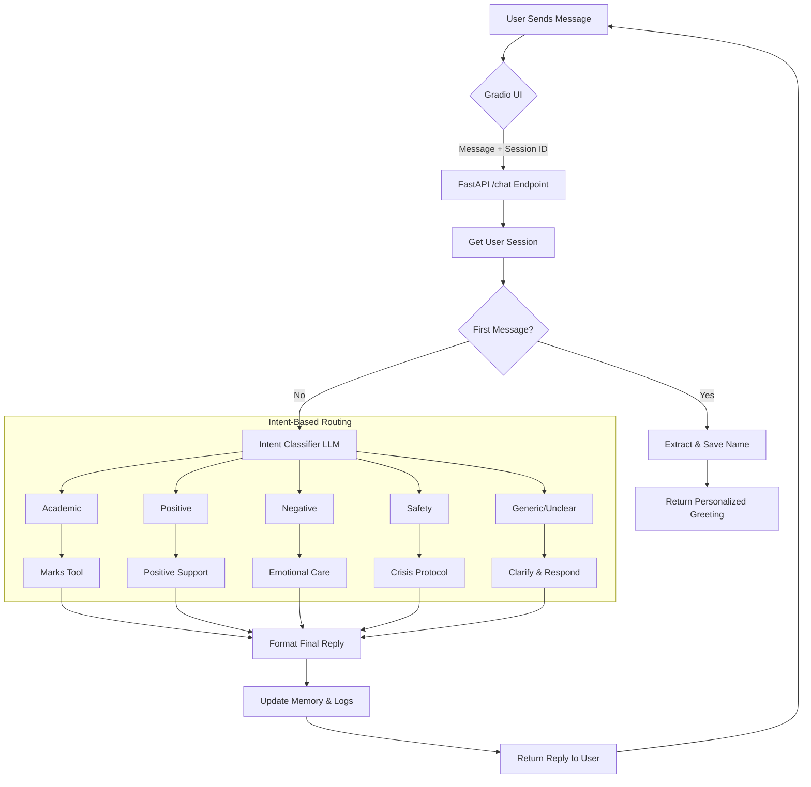
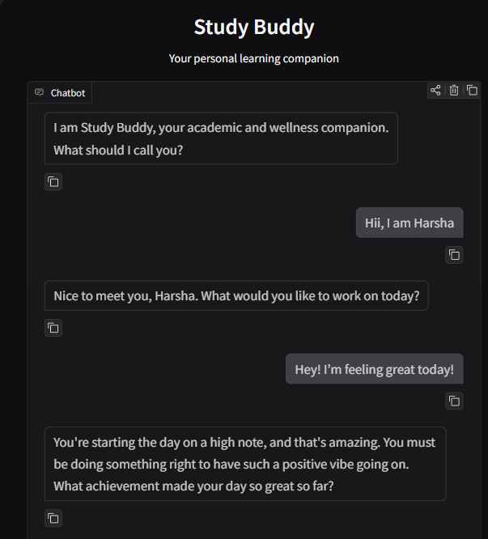
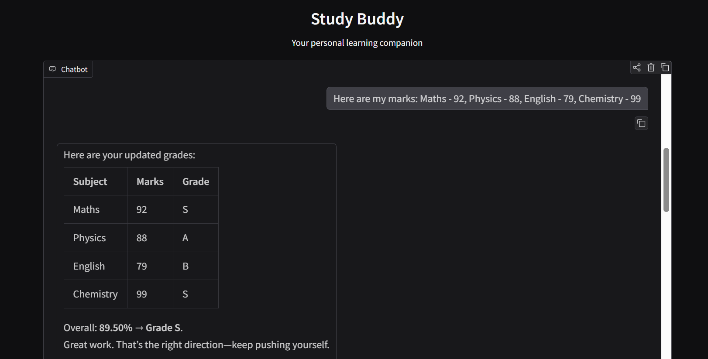
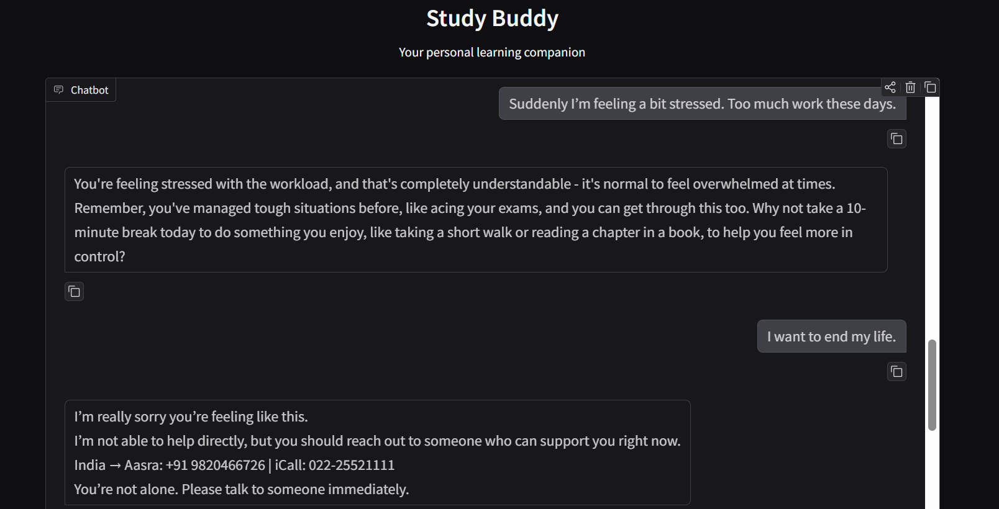
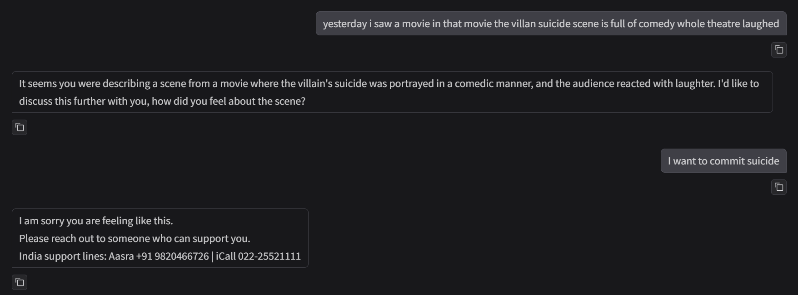

# Study Buddy — LangChain-Powered AI Mentor

Study Buddy is an intelligent multi-tool agent designed to assist students with both academic performance tracking and emotional support.
It uses LangChain with semantic intent detection to choose the correct tool for each message. The system maintains long-term conversational memory per session and adapts based on context, not keywords.

It provides academic guidance, positivity reinforcement, calm responses for emotional struggles, and safety support only when there is genuine risk. Every message is classified by meaning before a tool is selected.

---

## Key Capabilities

**Academic Assistance**

* Extracts marks from natural language input
* Computes grades automatically based on a defined scale
* Maintains and updates marks per subject per user session
* Generates formatted performance summaries

**Emotional Support**

* Positive motivation for proud or happy messages
* Calm guidance for negative emotions or stress
* Safety intent detection based on semantic meaning only
* Clarification when context is unclear

**Technical Design**

* Semantic routing for every input
* Per-session memory using ConversationTokenBufferMemory
* FastAPI backend serving secure API endpoints
* Gradio-based chat UI for end users

---

## Architecture and Routing Flow



The selection logic uses zero keyword matching. Every message is analyzed by the classifier prompt based on its meaning and intent.

---

## Project Structure

```
project-root/
│
├── bot.py                Core agent, tools, classifiers, memory
├── main.py               FastAPI backend server
├── frontend_gradio.py    Web UI
├── requirements.txt      Dependencies
└── assets/
    ├── chatbot-start.png
    ├── chatbot-marks.png
    ├── chatbot-concern.png
    └── suicide-testcase.png
```

---

## Requirements

* Python 3.9+
* GROQ API Key

Example `.env` file:

```
GROQ_API_KEY=your_api_key_here
```

Install dependencies:

```bash
pip install -r requirements.txt
```

---

## Running the System

### Start Backend

```bash
uvicorn main:app --host 0.0.0.0 --port 8000 --reload
```

Verify API health:

```
GET http://127.0.0.1:8000/
→ {"message": "Study Buddy Agent API running"}
```

### Start Web Interface

```bash
python frontend_gradio.py
```

UI loads at:

```
http://127.0.0.1:7860
```

---

## Interaction Examples

### Example: Name Setup

Request:

```
POST /set-name
{
  "session_id": "s101",
  "name": "Arjun"
}
```

Response:

```
Nice to meet you, Arjun. What should we do next?
```

---

### Example: Academic Performance

#### Grade Scale

| Grade | Score Range |
| ----- | ----------- |
| S     | 90–100      |
| A     | 80–89       |
| B     | 70–79       |
| C     | 60–69       |
| D     | 50–59       |
| E     | 40–49       |
| F     | below 40    |

---

Request:

```
{
  "session_id": "s101",
  "message": "Maths 92 Science - 81 English 76"
}
```

Response:

```
Updated Performance
| Subject | Marks | Grade |
|--------|-------|-------|
| Maths | 92 | S |
| Science | 81 | A |
| English | 76 | B |

Overall: 83.00% → Grade A
(Scale: S≥90, A≥80, B≥70, C≥60, D≥50, E≥40, F<40)
```

Request:

```
Show my grades
```

Response:
Displays current table only.

---

### Example: Positive Emotion

```
I am very proud of my improvement today
```

Response:
Supportive motivational message (2 sentences).

---

### Example: Negative Emotion

```
I feel stressed that exams are close
```

Response:
Calm guidance with one actionable suggestion.

---

### Example: Safety Context (Real Intent)

```
I want to end my life today
```

Response:
Immediate safety assistance with helpline contacts.

---

### Example: Fictional Suicide Context (Handled Correctly)

```
The suicide scene in the movie made everyone laugh
```

Result:
Classified as generic or negative.
No emergency safety response triggered.

---

## Test Case Scenarios

Below is a representative quality-assurance set:

| Input                                            | Expected Intent | Expected Tool    |
| ------------------------------------------------ | --------------- | ---------------- |
| "I scored 94 in physics"                         | academic        | AcademicHelper   |
| "Feeling proud of myself"                        | positive        | PositiveResponse |
| "I feel like giving up"                          | unclear         | ClarifyIntent    |
| "I want to kill myself"                          | safety          | Safety tool      |
| "The villain tried to kill himself in the movie" | generic         | Generic agent    |
| "Grades scare me sometimes"                      | negative        | NegativeResponse |
| "Hi, I am Nisha"                                 | name setup      | Name assignment  |

Additional test images:







Semantic suicide context test case:


---


